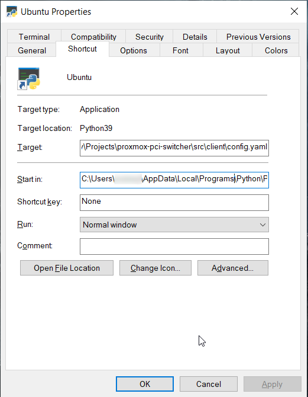

# Proxmox PCI Switcher <!-- omit in toc -->

Switch among Guest VMs organized by `Resource Pool`.

main features:

- `ONE` GPU card, `N` SO (at once)
- Guest VM command client
- Handler power off
- Reset framebuffer

**TOC**

- [Proxmox Configuration](#proxmox-configuration)
  - [Create Resource Pool](#create-resource-pool)
  - [Assign Guest VM](#assign-guest-vm)
- [Install Proxmox Snippet](#install-proxmox-snippet)
  - [Proxmox Config](#proxmox-config)
    - [Snippet Variables](#snippet-variables)
    - [Assign VM to Snippet](#assign-vm-to-snippet)
- [Guest Client Switcher](#guest-client-switcher)
  - [Execute Client](#execute-client)

## Proxmox Configuration

### Create Resource Pool


> The name of resource pool will match with `_POOL_NAME` variable at `pci-group-switcher.sh`.

### Assign Guest VM


## Install Proxmox Snippet

```bash
curl https://raw.githubusercontent.com/rosineygp/proxmox-pci-switcher/master/src/snippets/pci-group-switcher.sh > pci-group-switcher.sh

# set execution permission
chmod +x pci-group-switcher.sh

# move for your snippets <storage>/<folder>
```

### Proxmox Config

#### Snippet Variables

| NAME                   | Default          | Description                                                    |
| ---------------------- | ---------------- | -------------------------------------------------------------- |
| _POOL_NAME *           | <auto discovery> | The name of `Resource Pool`                                    |
| _SHUTDOWN_TIMEOUT      | 300              | Checking if resource was released (Current VM Running is down) |
| _RESET_GPU_FRAMEBUFFER | true             | Reset GPU framebuffer                                          |

> This variables must be changed in `pci-group-switcher.sh` at proxmox ve.
> 
> `_POOL_NAME` * By default it will scan for VMID in all Resource Pools, in case of long delays replace function call to Resource Pool name (eg. desktop).

#### Assign VM to Snippet

```bash
qm set <vmid> -hookscript <storage>:snippets/pci-group-switcher.sh
```

> After proxmox configuration is possible to switch using proxmox api or web interface.

## Guest Client Switcher

- requirements: python 3

```bash
git clone https://github.com/rosineygp/proxmox-pci-switcher.git ~/.proxmox-pci-switcher

cd ~/.proxmox-pci-switcher

pip3 install -r requirements.txt

# create config folder or using passing parameter -c
mkdir -p ~/.config/proxmox-pci-switcher

# copy or create config.yaml
cp ~/.proxmox-pci-switcher/src/client/config.yaml .config/proxmox-pci-switcher/config.yaml

# edit config file
```

- config.yaml

```yaml
# default location: ~/.config/proxmox-pci-switcher/config.yaml
proxmox:
  host: '<ip or dns>'
  user: '<user>@<method>'
  password: '<password>'
  verify_ssl: false

targets:
  - name: <label>
    vmid: <proxmox uuid>
```

### Execute Client

```bash
python ~/.proxmox-pci-switcher/src/client/proxmox-pci-switcher.py <target>

# passing config file
python ~/.proxmox-pci-switcher/src/client/proxmox-pci-switcher.py <target> -c <config_path>

# create a alias for better experience
alias windows="python ~/.proxmox-pci-switcher/src/client/proxmox-pci-switcher.py windows"

# and just run
windows
```

For windows is possible create a shortcut for better experience.




Target: `C:\Users\<user>\AppData\Local\Programs\Python\Python39\python.exe C:\Users\<user>\Projects\proxmox-pci-switcher\src\client\proxmox-pci-switcher.py ubuntu -c C:\Users\<user>\Projects\proxmox-pci-switcher\src\client\config.yaml`

Start in: `C:\Users\<user>\AppData\Local\Programs\Python\Python39`

> For windows config.yml must be explicit !bug