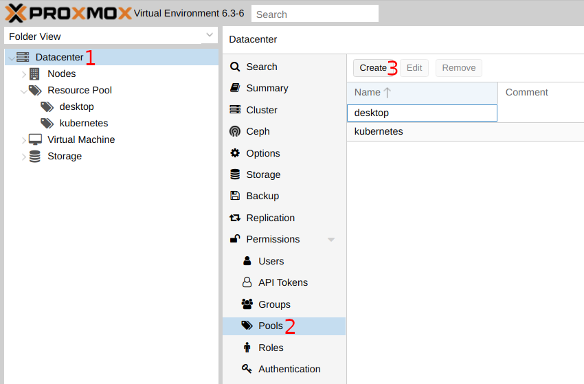
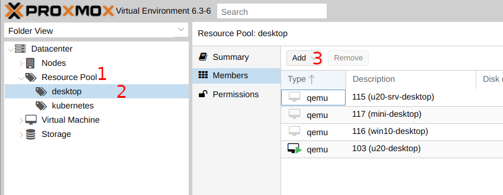
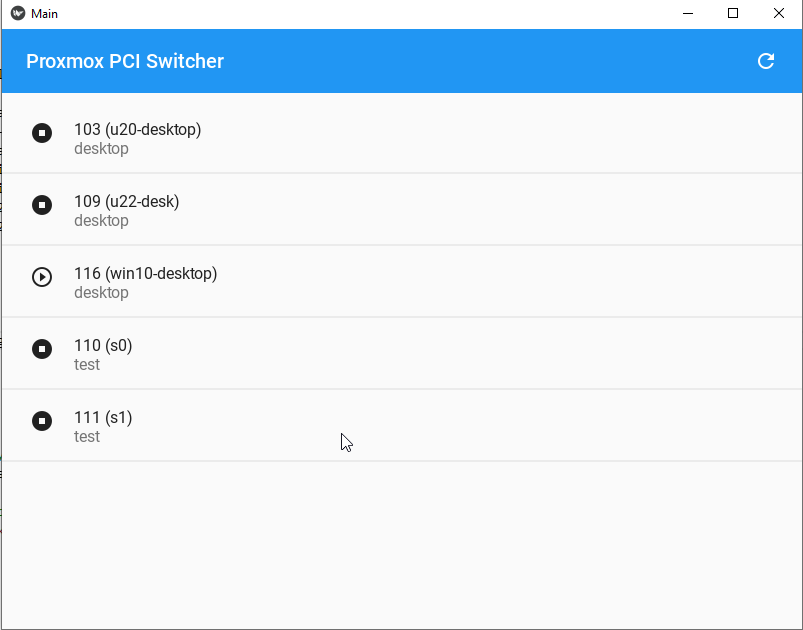

# Proxmox PCI Switcher <!-- omit in toc -->


[](https://sonarcloud.io/dashboard?id=rosineygp_proxmox-pci-switcher)

Switch among Guest VMs organized by `Resource Pool`.

main features:

- `ONE` GPU card, `N` OS (at once)
- Guest VM command client
- Handler power off
- Reset framebuffer

**TOC**

- [Proxmox Configuration](#proxmox-configuration)
  - [Create Resource Pool](#create-resource-pool)
  - [Assign Guest VM](#assign-guest-vm)
- [Install Proxmox Snippet](#install-proxmox-snippet)
  - [Proxmox Config](#proxmox-config)
    - [Snippet Variables](#snippet-variables)
    - [Assign VM to Snippet](#assign-vm-to-snippet)
- [Guest Client Switcher](#guest-client-switcher)
  - [List Resources](#list-resources)
  - [Switch Resource](#switch-resource)
  - [Using GUI](#using-gui)

## Proxmox Configuration

### Create Resource Pool



### Assign Guest VM



## Install Proxmox Snippet

```bash
curl -fsSL https://github.com/rosineygp/proxmox-pci-switcher/releases/latest/download/pci-group-switcher.sh > pci-group-switcher.sh

# set execution permission
chmod +x pci-group-switcher.sh

# move for your snippets <storage>/<folder>
```

### Proxmox Config

#### Snippet Variables

| NAME                   | Default           | Description                                                        |
| ---------------------- | ----------------- | ------------------------------------------------------------------ |
| _POOL_NAME *           | \<auto_discovery> | The name of `Resource Pool`                                        |
| _SHUTDOWN_TIMEOUT      | 300               | Checking if resource was released (Current VM Running is down)     |
| _RESET_GPU_FRAMEBUFFER | true              | Reset GPU framebuffer                                              |
| _PIN_CPU_IDS           | false             | Pin CPU using `taskset` (syntax equals taskset cpu-list parameter) |
| _RENICE_PRIORITY       | false             | Renice process using `renice`                                      |

> All variables must be changed in `pci-group-switcher.sh` at proxmox ve.
>
> `_POOL_NAME` * By default it will scan for VMID in all Resource Pools, in case of long delays replace function call to Resource Pool name (eg. desktop, gpu, ...).

The following variables can be passed using `/etc/pve/qemu-server/<vmid>.vars` file, the script will load variables from file if it exists.

> If you need to overwrite an Default value set at `/etc/environment` the variable name without the `_` prefix. (eg. RESET_GPU_FRAMEBUFFER=false)

#### Assign VM to Snippet

```bash
qm set <vmid> -hookscript <storage>:snippets/pci-group-switcher.sh
```

> After proxmox configuration is possible to switch using proxmox api or web interface.

## Guest Client Switcher

- requirements: python 3

```bash
pip install proxmox-pci-switcher

# create config folder
mkdir -p ~/.config/proxmox-pci-switcher/

# create config file
cat <<EOF > ~/.config/proxmox-pci-switcher/config.yaml
proxmox:
  host: '<ip or dns>'
  user: '<user>@<method>'
  password: '<password>'
  api_id: '<name>'          # only for api access
  api_token: '<token>'      # only for api access
  verify_ssl: false

gui:                        # optional
  theme: Dark               # Light or Dark

pools:
  - '<desktop>'
  - '<gpu-nvidia>'
  - '<gpu-amd>'

EOF
```

> Edit `config.yaml` with your proxmox credentials and pools.

> API access has priority over user and password access.

### List Resources

```bash
proxmox-pci-switcher list

pool(s)       vmid  name             status    type
----------  ------  ---------------  --------  ------
desktop        119  catalina         stopped   qemu
desktop        116  win10-desktop    stopped   qemu
desktop        117  mini-desktop     stopped   qemu
desktop        103  u20-desktop      running   qemu
desktop        115  u20-srv-desktop  stopped   qemu
```

### Switch Resource

```bash
# run command directly
proxmox-pci-switcher switch win10-desktop

# create a alias for better experience
alias windows="proxmox-pci-switcher switch win10-desktop"

# and just run
windows
```

### Using GUI

```bash
proxmox-pci-switcher gui
```


